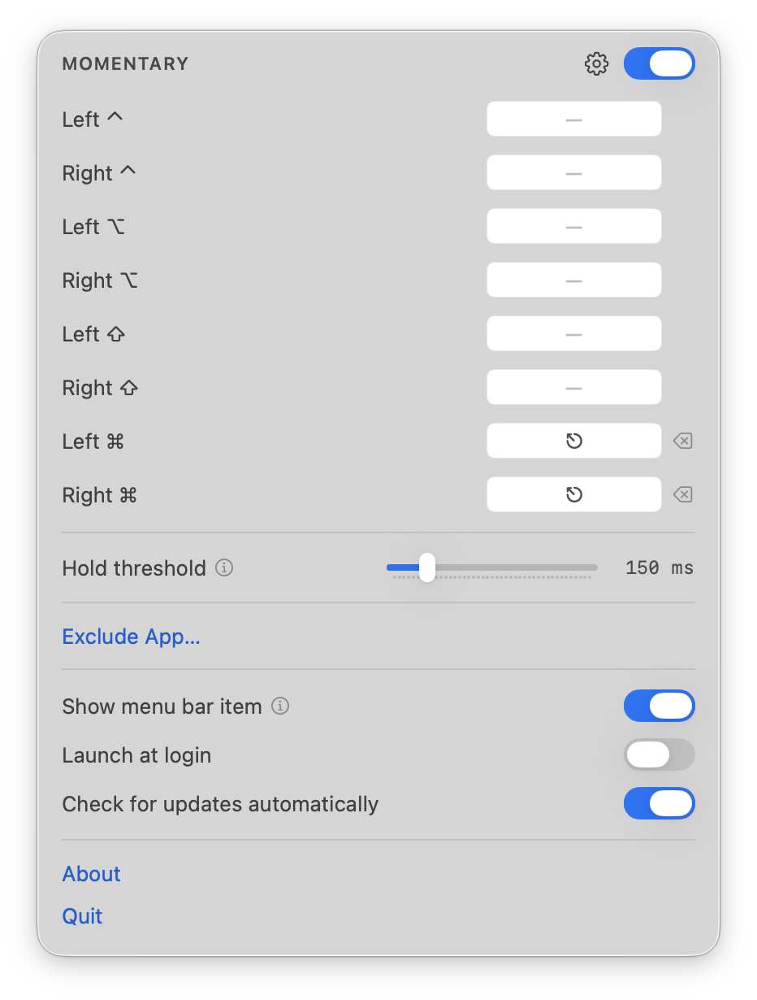

<h1 align="center">Momentary</h1>

<p align="center">
  <b>Tap a modifier, send a key. Hold it, and it's just a modifier.</b><br>
  A macOS app that gives every modifier key a second job, without taking away its first.
</p>

<p align="center">
  <a href="https://dennistimmermann.github.io/momentary/">Website</a> ·
  <a href="https://github.com/dennistimmermann/momentary/releases/latest">Download</a> ·
  <a href="https://github.com/dennistimmermann/momentary/releases">Changelog</a> ·
  <a href="https://github.com/dennistimmermann/momentary/issues">Issues</a>
</p>

<p align="center">
  
</p>

Tap ⌘ on its own and it sends Escape. Hold it, or use it with any other key, and it is the ⌘ it
always was. Out of the box that is the only rule — on both ⌘ keys, because that is the one worth
having on a keyboard with no physical Escape. Every modifier gets its own row, left and right told
apart, and each one can send whatever combination you record for it.

## Features

- **Per-side rules** — left ⌘ and right ⌘ are different keys, so you can change one and leave the other alone
- **Hold a modifier to find its row** — the row lights up, so a remapped key is never a guessing game
- **Any output** — click the field, press the combination you want; ⎋, F13, ⌘Space, anything
- **Adjustable hold threshold** — how long a press can last and still count as a tap
- **App exclusions** — stands down while a listed app is frontmost, for games, VMs and remote desktops
- **Stays out of the way** — no Dock icon, one menu bar item, and you can turn that off too
- **No driver** — nothing in the kernel, unlike every remapper that can do more than this one
- **Reads only modifiers** — anything else is collapsed to "something happened" without reading the key; nothing is stored or sent anywhere

## Install

Download [Momentary.dmg](https://github.com/dennistimmermann/momentary/releases/latest/download/Momentary.dmg),
drag `Momentary.app` into `/Applications`, and launch it.

Or with Homebrew:

```sh
brew install --cask dennistimmermann/tap/momentary
```

Momentary asks for **Accessibility** permission. It needs it to send the key a tapped modifier is
mapped to — macOS does not deliver a synthetic key press from an app that has not been granted it.

That is a broad permission, so it is worth being exact about what is and is not a guarantee. The
event tap Momentary installs is *listen-only*: it does not modify or swallow anything you type, and
it never reads which key you pressed — anything that is not a modifier is collapsed to "something
happened" without the key code being looked at. But that is a property of the code, not of the
sandbox. Accessibility is precisely the permission that would let any app do otherwise, and nothing
in macOS holds Momentary to it. Read [`ModifierTap.swift`](Momentary/ModifierTap.swift) — it is
about a hundred lines — or don't grant it.

What it genuinely does not do: install a kernel extension or driver of any kind, store anything you
type, or send anything anywhere. The update check is its only network request.

## Using it

Momentary has no Dock icon and no window while it works — just a menu bar item. Click it and the
settings drop down from it.

You can turn the menu bar item off too, and then Momentary runs with nothing on screen at all; the
settings become an ordinary window instead. Either way, **launching Momentary again opens them** —
from Finder, Spotlight, or `open -a Momentary`. macOS turns that second launch into a message to the
copy already running, so there is never more than one.

| Setting | What it does |
|---|---|
| **When tapped, send** | One row per modifier, left and right separate. Click a field and press the combination you want that modifier to send when it is tapped on its own. ⌫ clears a row. Holding a modifier lights up its row, which is how you tell which one a remapped key reports as. |
| **Hold threshold** | How long you can hold a modifier and still have it count as a tap. Longer is more forgiving. It delays nothing — the modifier itself always works immediately. |
| **Never in these apps** | While one of these is frontmost, every rule stands down. For games, Parallels, VNC and anything else where you lean on ⌘ or mean Escape literally. |
| **Show menu bar item** | The menu bar item these settings drop out of. On by default. Off leaves nothing on screen at all, and the settings become a window you reach by launching Momentary again. |
| **Check for updates automatically** | Looks for new releases on GitHub and offers to install them. This check is the only network request the app makes. |
| **Launch at login** | Starts Momentary when you log in. |

### Caps Lock, and other remapped keys

Caps Lock is not in the list: its state toggles below the level Momentary works at, and doing it
properly needs a kernel driver. The route that does work, and costs nothing: remap it in System
Settings ▸ Keyboard ▸ Keyboard Shortcuts ▸ Modifier Keys. Set **Caps Lock → Control** and the
**⌃** row gives you the classic tap-for-Escape, hold-for-Control setup.

**A remapped key reports as the right-hand side, wherever it physically is.** Map Caps Lock to ⌘ and
macOS delivers it as *right* ⌘ — on a key at the far left of the keyboard. It is also why both ⌘ rows
are mapped out of the box rather than just the left one.

You never have to guess which row is yours: **hold a modifier and its row lights up.** That is the
reliable way to identify a remapped key, and it works whether or not the key has a rule yet.

### What it can't do

While macOS has **secure input** on — a password field, mostly — no application receives key events,
Momentary included. Modifiers behave normally there and no rule fires.

## Building

Requires Xcode 26 and macOS 14 or later.

```sh
git clone https://github.com/dennistimmermann/momentary.git
cd momentary
xcodebuild -project Momentary.xcodeproj -scheme Momentary -configuration Release build
```

A **listen-only** `CGEventTap` watches `flagsChanged`, key presses, mouse buttons and the scroll
wheel. Listen-only means the callback's return value is ignored, so this build cannot alter or
withhold an event — but that is a choice in one argument, not something the system enforces, and an
app holding Accessibility can change it without asking anyone. Treat it as a commitment you can read,
not a guarantee you are given.

Which *physical* modifier is down comes from the device-dependent bits macOS puts in every event's
flags — `CGEventFlags` alone only says "a command key is down", never which one, which is what makes
per-side rules possible at all.

Watching would only need Input Monitoring; the Accessibility grant is for the other half of the job.
An untrusted process can create the events it posts and other taps will even see them, but no
application ever receives them — silently, with no error anywhere.

The decision itself lives in `TapEngine`, a struct with no `CGEvent`, no clock and no I/O: a modifier
pressed alone becomes a candidate, anything else disarms it, and a release inside the threshold sends
its output. That purity is what lets `TapEngine.runSelfCheck()` cover the whole table with plain
`assert`s — it runs at launch in debug builds, so a broken rule crashes the dev build rather than
showing up later as the occasional stray Escape.

Tagging a commit `vX.Y.Z` and pushing the tag builds that version and attaches it to a GitHub
release.

## Support

Bugs and requests go to [Issues](https://github.com/dennistimmermann/momentary/issues).

Momentary is free and stays free. If it saved you some friction, you can leave a tip on
[Ko-fi](https://ko-fi.com/tmrmn) or sponsor me on
[GitHub](https://github.com/sponsors/dennistimmermann).

## Credits

Automatic updates are powered by [Sparkle](https://github.com/sparkle-project/Sparkle), MIT licensed.

[MIT](LICENSE) © 2026 Dennis Timmermann
